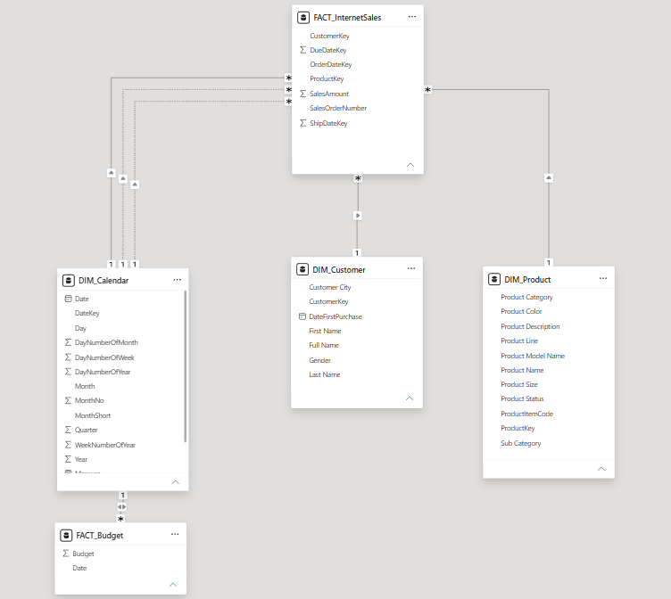

# 📊 Sales Performance Analytics

> **End-to-end SQL data engineering pipeline** — from raw AdventureWorks warehouse tables to a clean, analysis-ready star schema powering internet sales performance reporting.

[](https://learn.microsoft.com/en-us/sql/samples/adventureworks-install-configure)
[]()
[]()
[]()
[]()

---

## 🎯 The Business Problem

Leadership needed a **reliable, analysis-ready foundation** for internet sales performance — revenue sliced by time, product, and customer — with budget data ready for actual-vs-target comparisons.

Raw warehouse tables were messy: inconsistent naming, unfiltered history, missing values, and no clear fact/dimension boundaries. I transformed them into a clean, documented star schema that any BI tool or analyst can plug into immediately.

---

## ✅ What I Delivered

| Deliverable | Description |
|---|---|
| 🧹 **4 T-SQL cleaning scripts** | Production-ready transforms with joins, CASE logic, null handling & scoped filters |
| ⭐ **Star schema design** | 1 fact table + 3 conformed dimensions + budget table with documented join keys |
| 📁 **4 clean CSV exports** | Header-ready datasets loadable into Excel, Python, R, or any BI platform |
| 💰 **Budget integration layer** | Monthly targets joinable to the calendar dimension for actual-vs-budget reporting |

---

## 📐 Data Model


**Join key reference:**

| Fact Column | Dimension | Cardinality |
|---|---|---|
| `ProductKey` | `DIM_Product.ProductKey` | Many → One |
| `CustomerKey` | `DIM_Customer.CustomerKey` | Many → One |
| `OrderDateKey` | `DIM_Calendar.DateKey` | Many → One |
| `DueDateKey` | `DIM_Calendar.DateKey` | Many → One *(role-playing date)* |
| `ShipDateKey` | `DIM_Calendar.DateKey` | Many → One *(role-playing date)* |
| `Fact_Budget.Date` | `DIM_Calendar.Date` | Many → One |

---

## 🔧 SQL Cleaning Scripts

Each script targets a single table and applies focused transforms to produce analysis-ready output:

### `DIM_Calendar.sql`
Extracts the date spine with business-friendly labels (Year, Quarter, Month) for time-based slicing and filtering.

### `DIM_Customer.sql`
Selects customer demographics and city, with `CASE` logic to decode gender codes into readable values and `LEFT JOIN` to pull geography.

### `DIM_Product.sql`
Builds the product hierarchy (category + subcategory + product) using `LEFT JOIN` across three source tables, with `ISNULL` to handle missing product status.

### `FACT_InternetSales.sql`
Extracts 58K+ revenue transactions, scoped to a **rolling 2-year window** using a `WHERE` filter on `OrderDateKey` — keeping the dataset focused and performant.

**T-SQL techniques applied across scripts:**

| Technique | Purpose |
|---|---|
| `LEFT JOIN` | Enriching dimensions with geography & category data |
| `CASE` expressions | Decoding coded values (e.g. gender) into readable labels |
| `ISNULL` | Handling missing product status gracefully |
| `WHERE` date filter | Scoping fact data to a rolling 2-year window |
| `ORDER BY` | Ensuring consistent, reproducible CSV exports |
| Column aliasing | Business-friendly naming conventions throughout |

---

## 📦 Dataset Summary

| Table | Rows | Key Columns |
|---|---|---|
| `FACT_InternetSales` | 58,169 | ProductKey, OrderDateKey, CustomerKey, SalesAmount |
| `DIM_Customer` | 18,484 | CustomerKey, Full_Name, Gender, Customer_City |
| `DIM_Product` | 606 | ProductKey, Product_Name, Product_Category, Product_Status |
| `DIM_Calendar` | 8,036 | DateKey, Date, Year, Quarter, Month |
| `Fact_Budget` | 18 | Date, Budget |

> **Date range:** 2024 – 2026 &nbsp;|&nbsp; **Source:** AdventureWorksDW2019

---

## 🗂️ Repository Structure

```
Sales-Performance-Analytics/
│
├── README.md
├── .gitignore
│
├── sql_cleaning/               ← T-SQL transformation scripts
│   ├── DIM_Calendar.sql
│   ├── DIM_Customer.sql
│   ├── DIM_Product.sql
│   └── FACT_InternetSales.sql
│
├── data/                       ← Cleaned, analysis-ready CSV exports
│   ├── DIM_Calendar.csv
│   ├── DIM_Customer.csv
│   ├── DIM_Product.csv
│   └── FACT_InternetSales.csv
│
└── external_data/              ← Budget targets for actual-vs-budget analysis
    └── Sent Over Data - SalesBudget.xlsx
```

---

## 🚀 How to Reproduce

### Prerequisites
- SQL Server with [AdventureWorksDW2022](https://learn.microsoft.com/en-us/sql/samples/adventureworks-install-configure) restored

### Steps

```bash
# 1. Clone the repository
git clone https://github.com/your-username/Sales-Performance-Analytics.git

# 2. Open SQL Server Management Studio (SSMS) or Azure Data Studio
# 3. Run each script in sql_cleaning/ against AdventureWorksDW2019
# 4. Export results to CSV and save in data/
```

### Quick validation query

```sql
-- Verify fact table row count and total revenue
SELECT
    COUNT(*)        AS TotalSales,
    SUM(SalesAmount) AS TotalRevenue
FROM dbo.FactInternetSales AS f
WHERE f.OrderDateKey >= (
    SELECT MIN(DateKey)
    FROM dbo.DimDate
    WHERE CalendarYear >= YEAR(GETDATE()) - 2
);
```

Expected: **~58,169 rows** across the rolling 2-year window.

---

## 🧠 Skills Demonstrated

```
T-SQL Development      ████████████████████  Joins · Filtering · CASE logic · Null handling
Dimensional Modeling   ██████████████████░░  Fact/dim design · Surrogate keys · Role-playing dates
ETL Workflow Design    ████████████████░░░░  Source-to-target pipeline · Documented transforms
Data Quality           ████████████████░░░░  Scoped extracts · Consistent naming conventions
Business Analytics     ███████████████░░░░░  KPI-oriented design · Budget comparison layer
```

---

## 💡 Key Design Decisions

**Why a rolling 2-year window?**  
Scoping the fact table to recent data keeps exports lean and queries fast — a common pattern in production data warehouses where full historical loads are handled separately.

**Why role-playing dates?**  
A single `DIM_Calendar` table handles `OrderDateKey`, `DueDateKey`, and `ShipDateKey` through aliasing — avoiding table duplication while preserving analytical flexibility for lead time and shipping lag analysis.

**Why conformed dimensions?**  
`DIM_Calendar`, `DIM_Customer`, and `DIM_Product` are designed to be reusable across multiple fact tables — a hallmark of enterprise-grade dimensional modeling (Kimball methodology).

---

## 📄 License & Data

Sales data sourced from Microsoft's publicly available **AdventureWorks** sample database, used for educational and portfolio purposes only. No proprietary data included.

---

<div align="center">

*Built to demonstrate SQL-based data preparation and star-schema design for sales analytics.*  
*Open to feedback, collaboration, and new opportunities.*

</div>
